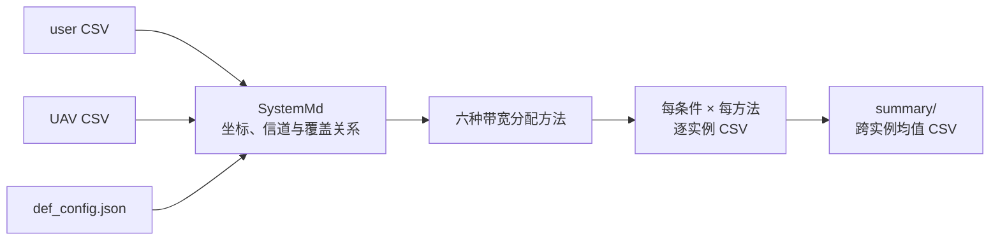

# UAVBandwidthAllocation

面向混合 QoS 用户的多无人机（UAV）带宽分配研究代码。该 Visual Studio C++ 工程包含两种当前提出方法、四种当前对比方法、EXP1–EXP4 实验驱动、逐实例结果记录和跨实例汇总逻辑。

> **当前状态（2026-09-03 源码审计）**
>
> - 当前 [`main.cpp`](main.cpp) 默认启用 `exp2_different_uav_number()`；其他实验和测试需要手工切换源码入口。
> - 该工程是研究代码，不是克隆后即可一键复现的完整软件包。正式 user/UAV 实例 CSV 不随当前 Git 快照同步，第三方依赖和部分路径仍绑定本机环境。
> - 本 README 根据当前源码、Visual Studio 项目文件和现有配置编写；本次文档维护没有构建工程、运行算法或重新验证历史数值结果。

仓库的整体数据链、历史资产和同步边界见[仓库级 README](../../README.md)；输入实例的恢复规则和 CSV schema 见 [`ExperimentsData/data/README.md`](../../ExperimentsData/data/README.md)。

## 1. 研究问题与程序职责

工程研究多个 UAV 为两类用户分配关联关系和带宽的问题：

- **hard 用户**：具有最低传输速率和中断概率要求；只有满足相应 QoS 条件时才获得离散效用。
- **elastic 用户**：效用随分配带宽连续增长，程序使用凹型效用模型处理其资源分配。
- **UAV**：每架 UAV 具有独立带宽预算，只能服务覆盖范围内的用户。

程序从配对的用户/UAV CSV 和信道配置 JSON 构造 `SystemMd`，计算距离、SNR、信道容量、hard 用户最低带宽以及每架 UAV 的可服务用户集合，然后在同一实例上依次运行六种方法。



该程序的主要职责是算法计算和结果记录。人口栅格预处理、用户位置生成与 UAV 空间部署位于仓库的 [`ExperimentsData/DatasetTest`](../../ExperimentsData/DatasetTest/)；它们不属于本 Visual Studio 工程。

## 2. 当前六种实验方法

[`experiments.h`](experiments.h) 中的 `method_name_list` 定义了结果文件名；同一文件中的 `run_Instance_with_checkpoint()` 给出了当前实际调用关系。

| 结果标签 | 当前实际入口 | 实现文件 | 说明 |
| --- | --- | --- | --- |
| `ApproBetter` | `approposed_multiUAV_allocation_new(..., 2)` | [`EntityDefinition.cpp`](EntityDefinition.cpp) | 多 UAV 冲突消解框架 + `FPTAS_singleUAV_new`。调用未显式传入 `parameter`，因此使用声明中的默认值 `0.083`。 |
| `ApproFast` | `approposed_multiUAV_allocation_new(..., 1)` | [`EntityDefinition.cpp`](EntityDefinition.cpp) | 同一多 UAV 框架 + `WaterFillingAlgorithm_singleUAV_new(..., 1)`，包括 hard 用户舍入。 |
| `AlgDRL` | `ConvexRelaxationAndRounding_multiUAV()` | [`Convexrelaxationandrounding.cpp`](Convexrelaxationandrounding.cpp) | 当前 C++ 驱动实际执行的是 IPOPT 松弛—舍入实现。`AlgDRL` 是历史结果标签，不能仅凭名称将其解释为 Python DQN/DRL 推理。 |
| `AlgMatching` | `MatchingSQP_Allocation()` | [`MatchingSQP.cpp`](MatchingSQP.cpp) | 匹配更新与 IPOPT/SQP 带宽优化过程。 |
| `AlgHardFirst` | `HungarianMatchingAllocation()` | [`HungarianMatching.cpp`](HungarianMatching.cpp) | 基于 Hungarian/KM 的用户—子信道匹配；结果标签是历史命名，不足以证明实现严格采用“hard first”顺序。 |
| `AlgSADA` | `SADA_Allocation()` | [`SADA_algorithm.cpp`](SADA_algorithm.cpp) | successive approximation、对偶分解和 IPOPT 局部优化实现。 |

### 2.1 当前提出方法的真实多 UAV 流程

`approposed_multiUAV_allocation_new()` 不是多 UAV 全局联合优化器，也不是旧版逐轮选择 UAV 的顺序贪心实现。当前代码执行三个阶段：

1. **独立局部求解**：对每架 UAV 的 `uav_serviceable_users_map[uav_id]` 独立运行一次单 UAV 算法。
2. **用户冲突消解**：若一个用户被多架 UAV 同时选择，则比较第一阶段的 `allocatedValue[user_id]`，仅保留效用最高的 UAV。
3. **局部重新优化**：在每架 UAV 冲突消解后保留的用户集合上，再运行一次相同的单 UAV 算法。

函数返回：

- `vector<KnapsackResult>`：每架 UAV 的用户集合、逐用户带宽/效用和聚合量；
- `map<int, UserResult>`：按内部用户 ID 给出的最终 UAV、带宽和效用。未服务用户保留默认值 `uav_id = -1`、带宽与效用为 0。

覆盖集合由 `SystemMd::init_SystemModel()` 按 `distance <= max_coverage_distance` 构造。当前从 CSV 构造模型时会将 UAV 和用户重新编号为连续 ID；算法内部多处直接使用 ID 索引 `vector`，因此通过其他接口传入非连续 ID 并不安全。

### 2.2 编译但未进入六方法循环的实现

[`MatchingGameAllocation.cpp`](MatchingGameAllocation.cpp) 在当前 `.vcxproj` 中参与编译，但 `run_Instance_with_checkpoint()` 不调用它。它不应与结果标签 `AlgMatching` 混同。

目录中还有若干未纳入当前 Visual Studio 编译项的文件：

- `Convexrelaxationandrounding_new.cpp`
- `EntityDefinition_short.cpp`
- `Matchinggameallocation_old.cpp`
- `setSysCode/` 下的独立/历史副本

判断“当前执行的是哪个版本”时，以 [`UAVBandwidthAllocation.vcxproj`](UAVBandwidthAllocation.vcxproj) 的 `<ClCompile>` 列表和 [`experiments.h`](experiments.h) 的调用关系为准，不要根据相似文件名推断。

## 3. 项目结构

| 路径 | 当前用途 |
| --- | --- |
| [`main.cpp`](main.cpp) | 唯一程序入口；通过注释/取消注释选择实验或手写测试。 |
| [`experiments.h`](experiments.h) | 六方法调度、计时、逐实例 CSV、断点续跑、均值统计和 EXP1–EXP4 驱动。 |
| [`EntityDefinition.h`](EntityDefinition.h) | `User`、`Uav`、`Channel`、`SystemMd`、`BAProblem`、`KnapsackResult` 等核心声明。 |
| [`EntityDefinition.cpp`](EntityDefinition.cpp) | CSV 解析、系统模型初始化、效用/信道逻辑、单 UAV 子算法和当前提出的多 UAV 方法。 |
| [`Convexrelaxationandrounding.cpp`](Convexrelaxationandrounding.cpp) | 当前 `AlgDRL` 标签对应的 IPOPT 松弛—舍入方法。 |
| [`MatchingSQP.cpp`](MatchingSQP.cpp) | `AlgMatching` 的匹配—SQP/IPOPT 实现。 |
| [`HungarianMatching.cpp`](HungarianMatching.cpp) | `AlgHardFirst` 标签对应的 Hungarian/KM 实现。 |
| [`SADA_algorithm.cpp`](SADA_algorithm.cpp) | `AlgSADA` 实现。 |
| [`MatchingGameAllocation.cpp`](MatchingGameAllocation.cpp) | 当前参与编译、但未进入标准六方法实验循环的匹配博弈实现。 |
| [`predefine.h`](predefine.h) | 公共头文件、数值常量、第三方头文件以及本机绝对路径。 |
| [`config.h`](config.h) | JSON 实验配置结构和固定种子 `42` 的内存随机实例生成器；EXP1–EXP4 当前直接读取 CSV，并不调用该生成器。 |
| [`config/def_config.json`](config/def_config.json) | 通用/手写测试可用的信道配置；不等同于 EXP1–EXP3 驱动实际加载的配置。 |
| [`config/readme.md`](config/readme.md) | 环境参数的历史说明。部分值与 JSON 版本不同，运行事实应以当前入口实际加载的 JSON 为准。 |
| `*_ipopt.opt` | IPOPT 的容差、迭代上限、Hessian 选项和日志级别。代码以相对路径读取这些文件。 |
| [`test.h`](test.h) | 手工测试与历史实验辅助函数；当前 `main.cpp` 默认未启用。 |
| [`UAVBandwidthAllocation.sln`](UAVBandwidthAllocation.sln) | Visual Studio 解决方案。 |
| [`UAVBandwidthAllocation.vcxproj`](UAVBandwidthAllocation.vcxproj) | 当前编译源文件、平台、工具集和本机依赖路径的权威配置。 |
| [`packages.config`](packages.config) / `packages/` | `nlohmann.json` 3.12.0 的 NuGet 声明和当前本地包。 |

`.vs/`、`.vscode/`、`x64/`、`export/` 等本机目录不是算法接口。尤其是 `.vscode/tasks.json` 若存在，仅适合单文件尝试，不能替代包含多源文件和第三方链接依赖的 Visual Studio 工程构建。

## 4. 实验入口与条件矩阵

当前 [`main.cpp`](main.cpp) 中唯一未注释的实验为：

```cpp
exp2_different_uav_number();
```

标准驱动没有命令行参数解析器。若要运行其他实验，需要在 `main.cpp` 中保证一次只启用一个入口，然后重新构建。

| 函数 | 自变量 | 当前条件 | 输入根目录 | 结果根目录 | 状态 |
| --- | --- | --- | --- | --- | --- |
| `exp1_different_user_number()` | 用户数 | `1000, 2000, 3000, 4000, 5000`；10 UAV | `data/variable_user_num/` | `ExperimentsResults/EXP1_user_num/` | 驱动和配置存在。 |
| `exp2_different_uav_number()` | UAV 数 | `5, 10, 15, 20`；固定 3000 用户 | 用户来自 `data/variable_user_num/3000u_num/`，UAV 来自 `data/variable_uav_num/` | `ExperimentsResults/EXP2_uav_num/` | **当前默认入口**。 |
| `exp3_different_hard_user_ratio()` | hard 用户比例 | 目录 `0, 2, 4, 6, 8, 10` 分别表示 `0, 0.2, ..., 1.0`；3000 用户、10 UAV | `data/variable_hard_user_ratio/` | `ExperimentsResults/EXP3_hard_user_ratio/` | 驱动和配置存在。 |
| `exp4_different_total_bandwidth()` | 每架 UAV 总带宽 | `10, 20, 30, 40, 50` MHz；3000 用户、10 UAV | 复用 `data/variable_user_num/3000u_num/` | `ExperimentsResults/EXP4_bandwidth/` | **当前标准路径缺少 `def_config.json`，不能直接视为可运行。** |

当前四个驱动都将实例数硬编码为 `count = 10`。文件配对函数虽然最多搜索 30 或 50 个 ID，但标准运行只处理排序后的前 10 对；运行前必须确认实际找到的配对数不少于 10，否则会发生越界访问风险。

EXP1–EXP3 调用 `run_Instance_with_checkpoint()` 时不显式传入总带宽，因此默认将每架 UAV 的带宽覆盖为 **40 MHz**。EXP4 则逐条件传入 10–50 MHz。换言之，在这些标准驱动中，UAV CSV 的 `bandwidth` 字段会在模型初始化后被实验条件覆盖。

需要注意覆盖发生的时机：`SystemMd` 构造函数先根据 CSV 带宽调用 `init_SystemModel()`，其中会调整噪声功率并计算 `cap_list`、`Bth_list` 等信道量；`run_Instance_with_checkpoint()` 随后才覆盖 `uav.total_bandwidth`，且没有重新初始化上述矩阵。因此当前带宽实验改变的是算法使用的资源预算，但不一定同步重算所有依赖带宽的信道量。EXP4 的物理含义和结果在正式使用前必须专项核对。

## 5. 构建环境

### 5.1 当前项目文件记录的环境

| 项目 | 当前配置 |
| --- | --- |
| 操作系统 / IDE | Windows，Visual Studio 2022 |
| MSVC 工具集 | `v143` |
| Windows SDK | `10.0` |
| C++ 标准 | C++17 |
| 推荐配置 | `Release|x64`；它是当前唯一显式写入完整 Boost、IPOPT 和 CPLEX 路径的配置 |
| JSON | `nlohmann.json` 3.12.0（NuGet） |
| 数值/数学库 | Boost 1.89.0 |
| 非线性优化器 | IPOPT 3.14.19 的 MSVC 2022 x64 构建 |
| 当前链接配置 | Release x64 仍显式链接 CPLEX 22.1.1、Concert 和 IloCplex 库 |

当前参与编译的源文件中未检索到 `Ilo*`/`ilcplex` 调用，但 `.vcxproj` 的 Release x64 链接项仍要求 CPLEX 库。因而在项目配置被单独验证并清理前，构建环境仍需满足这些链接项；不要仅凭“源码似乎未使用”就直接删除依赖。

项目文件中的绝对依赖路径包括：

- Boost：`E:\Mydvtools\boost_1_89_0`
- IPOPT：`C:\CodeEnv\Ipopt-3.14.19-win64-msvs2022-mdd`
- CPLEX：`D:\Program Files\IBM\ILOG\CPLEX_Studio2211`

这些路径不是可移植配置。其他机器必须在构建前将 Include、Library 和 Additional Dependencies 调整到本机真实安装位置。

### 5.2 Visual Studio 构建

1. 使用 Visual Studio 2022 打开 [`UAVBandwidthAllocation.sln`](UAVBandwidthAllocation.sln)。
2. 恢复 NuGet 包，确认 `packages/nlohmann.json.3.12.0` 可用。
3. 在项目属性中检查 `Release|x64` 的包含目录、库目录和附加依赖项。
4. 确认 Boost、IPOPT，以及当前项目仍链接的 CPLEX 库版本和架构均为 x64 且与 MSVC 工具集兼容。
5. 选择 `Release|x64`，执行“生成解决方案”。

也可以在 **Developer PowerShell for VS 2022** 中使用以下等价构建命令；它只是入口示例，仍以前述依赖配置正确为前提：

```powershell
msbuild .\UAVBandwidthAllocation.sln /m /p:Configuration=Release /p:Platform=x64
```

### 5.3 IPOPT 运行时

当前几个方法分别通过相对文件名加载：

- `relax_rounding_ipopt.opt`
- `Matching_SQP_ipopt.opt`
- `SADA_ipopt.opt`
- `MatchGame_ipopt.opt`（仅匹配博弈方法使用）

建议把调试工作目录设为 `$(ProjectDir)`，或在本目录中启动已构建的可执行文件，使 `.opt` 文件能够被找到。同时必须保证 IPOPT 及其求解器依赖 DLL 位于可执行文件旁或系统 `PATH` 中。

## 6. 运行前配置

### 6.1 先修正项目绝对路径

[`predefine.h`](predefine.h) 当前定义：

```text
algProjPath      = E:\Research\My paper\2_Papers\008\008_Experiment\Algorithms\UAVBandwidthAllocation\
experimentDataPath = E:\Research\My paper\2_Papers\008\008_Experiment\ExperimentsData\
```

其中使用的是 `My paper`，而当前工作区实际目录是 `My_paper`。EXP1–EXP4 都通过 `experimentDataPath` 拼接输入、配置和输出路径；按当前字符串直接运行会访问错误位置。运行前应将两个常量改为当前机器的真实绝对路径，最好在后续重构中改为命令行参数或相对路径。

### 6.2 恢复输入实例

当前 Git 快照不包含正式 user/UAV 实例 CSV。请按 [`ExperimentsData/data/README.md`](../../ExperimentsData/data/README.md) 从维护者管理的本机冻结副本或独立私有数据快照恢复数据，不要根据 README 猜测公共下载地址。

每个条件目录的预期布局为：

```text
<condition>/
├── user_data/
│   └── <instance>_<N>users_data_<adcode>.csv
└── uav_data/
    └── <instance>_<K>uavs_loc_<adcode>.csv
```

EXP2 是例外：用户文件固定来自 `variable_user_num/3000u_num/user_data/`，不同 UAV 数的文件来自 `variable_uav_num/<K>/uav_data/`。文件通过名称开头的数值型 `<instance>` ID 配对并按升序处理。

### 6.3 核对实际加载的信道配置

标准实验读取的是结果目录下的 JSON，而不是本项目的通用 [`config/def_config.json`](config/def_config.json)：

- [`EXP1_user_num/def_config.json`](../../ExperimentsData/ExperimentsResults/EXP1_user_num/def_config.json)
- [`EXP2_uav_num/def_config.json`](../../ExperimentsData/ExperimentsResults/EXP2_uav_num/def_config.json)
- [`EXP3_hard_user_ratio/def_config.json`](../../ExperimentsData/ExperimentsResults/EXP3_hard_user_ratio/def_config.json)

这些文件控制 LoS/NLoS 损耗、噪声谱密度、LoS 概率参数、最大覆盖距离、UAV 高度、载波频率、发射功率和天线增益。不同配置说明中的数值并不完全一致，解释一次运行时必须记录实际加载文件的内容与哈希。

### 6.4 为新运行隔离输出

标准驱动会直接在 [`ExperimentsData/ExperimentsResults`](../../ExperimentsData/ExperimentsResults/) 下创建或追加 CSV，并重写 `summary/` 中的汇总文件。为避免把新运行混入历史结果，建议先在代码中为本次运行指定新的、明确命名的结果根目录，并保留：

- 源码 commit/hash 和本地未提交差异；
- 输入实例版本或校验和；
- 实际 JSON 与 `.opt` 文件；
- 编译器、Boost/IPOPT/CPLEX 版本；
- 实验入口、条件、实例数和输出目录；
- 异常、超时、失败和人工中止记录。

## 7. 输入格式与解析规则

### 7.1 用户 CSV

```csv
user_id,longitude,latitude,user_type,user_weight,user_requirement_1,user_requirement_2,app_category
```

当前解析规则：

- 输入 `user_id` 不保留；程序先排列 hard 用户、再排列 elastic 用户，并重新赋予连续内部 ID。
- 只有精确字符串 `user_type == "hard"` 被识别为 hard 用户，其他字符串均进入 elastic 分支。
- `user_requirement_1` 读入为最低速率相关参数，并乘以 `unit_para`。
- 对 hard 用户，`user_requirement_2` 作为中断概率；对 elastic 用户，该字段被忽略。
- `app_category` 当前被读取器忽略。

### 7.2 UAV CSV

```csv
uav_id,longitude,latitude,bandwidth
```

当前解析规则：

- 输入 `uav_id` 不保留，程序按行重新赋予连续内部 ID。
- 经纬度与用户坐标一起以最小经纬度为原点，采用适合小范围区域的近似投影转换为米制坐标。
- `bandwidth` 读入后乘以 `unit_para`；标准 EXP1–EXP4 随后还会用实验条件覆盖该值。

### 7.3 单位

[`predefine.h`](predefine.h) 当前设置 `unit_para = 1000`。标准驱动接受以 MHz 表示的每 UAV 总带宽，并在算法内部转换为 KHz；相应速率量按同一比例进入内部计算。数据生成端的字段单位、算法内部单位和论文展示单位必须在正式复现记录中显式对齐，不能只根据变量名推断。

## 8. 输出格式

### 8.1 逐实例结果

每个实验条件目录包含六个方法文件：

```text
ApproBetter.csv
ApproFast.csv
AlgDRL.csv
AlgMatching.csv
AlgHardFirst.csv
AlgSADA.csv
```

每行对应一个按文件名 ID 排序后的输入实例，字段为：

```csv
duration,total_num,hard_num,elastic_num,total_utility,hard_utility,elastic_utility,hard_bandwidth,elastic_bandwidth,hard_throughput,elastic_throughput,total_throughput
```

其中 `duration` 由 `std::chrono` 以整毫秒计时后写入。结果行本身不保存输入文件名、实例 ID、随机种子、配置哈希或运行状态；实例对应关系只能依赖输入配对顺序和外部运行记录。

### 8.2 汇总结果

每个实验的 `summary/` 会生成：

```text
Run_time_ms.csv
Total_Num.csv
Hard_Num.csv
Elastic_Num.csv
Total_Utility.csv
Hard_Utility.csv
Elastic_Utility.csv
Hard_Bandwidth.csv
Elastic_Bandwidth.csv
Hard_Throughput.csv
Elastic_Throughput.csv
Total_Throughput.csv
```

汇总文件按条件计算各方法的算术平均值。当前导出器对所有实验都把首列写为 `User_Scale`，即使该列实际表示 UAV 数、hard ratio 或带宽；下游分析应根据实验目录解释，不要仅依赖列名。

## 9. 断点续跑机制

`run_Instance_with_checkpoint()` 会：

1. 为六种方法建立带表头的 CSV；
2. 只统计 `ApproBetter.csv` 的数据行数作为已完成实例数；
3. 从下一行开始，按六种方法的固定顺序逐个计算并立即追加结果；
4. 条件完成后，从现有方法 CSV 重新计算 summary。

该机制**不是事务式 checkpoint**。如果程序在同一实例的六种方法之间中断，`ApproBetter.csv` 可能已经多出一行，而后续方法尚未写入。再次启动时该实例可能被整体跳过，造成方法间行数错位。恢复前至少应核对六个文件的数据行数和预期输入顺序；发现不一致时，应先保留原文件作为故障证据，再在新的隔离输出目录重新运行相关条件。

## 10. 当前已知限制与审计提示

以下内容会直接影响构建、复现或结果解释：

1. **源码数据路径不匹配。** `predefine.h` 使用 `My paper`，当前工作区为 `My_paper`。
2. **依赖路径不可移植。** Boost、IPOPT 和 CPLEX 的绝对路径写在 `.vcxproj` 中。
3. **EXP4 标准配置缺失。** 代码期望 `ExperimentsResults/EXP4_bandwidth/def_config.json`，当前该文件不存在；其他历史目录中的同名配置不能未经核对直接代替。
4. **Git 快照不是完整运行包。** 正式实例 CSV 需要从独立私有/冻结数据资产恢复。
5. **没有统一 CLI。** 实验选择、实例数和部分参数通过源码硬编码。
6. **固定 `count = 10` 缺少边界检查。** 若找到的配对输入少于 10，驱动仍会索引前 10 项。
7. **checkpoint 只以 `ApproBetter` 为准。** 中断可能造成六方法 CSV 行数和实例位置不一致。
8. **结果行缺少实例标识和运行元数据。** 当前 CSV 不能单独证明某行来自哪个输入文件或配置版本。
9. **整数型均值会截断。** `total_num`、`hard_num` 和 `elastic_num` 是 `int`，汇总时执行整数除法；非整数平均值会被截断。
10. **提出方法的空 UAV 聚合量存在一致性风险。** 冲突消解阶段只从 `allocatedList` 删除用户；若某架 UAV 的列表因此变空，第二次求解会直接 `continue`，第一阶段的 `allocatedValue`/`totalValue` 等聚合数据可能残留，而结果统计又会累加这些聚合量。正式使用前应增加针对该路径的单元测试和约束检查。
11. **带宽预算覆盖后没有重算信道矩阵。** `SystemMd` 先按 CSV 带宽初始化噪声、容量和 hard 用户最低带宽，实验驱动随后才覆盖 UAV 总带宽；EXP1–EXP4 当前均未再次调用 `init_SystemModel()`。
12. **内部索引要求连续 ID。** CSV 构造流程会重新编号，因此标准数据路径满足该条件；直接调用算法时则需要调用者保证或显式映射。
13. **历史标签不等于实现证明。** 特别是 `AlgDRL` 当前映射到 C++ IPOPT 松弛—舍入方法，`AlgHardFirst` 映射到 Hungarian/KM 实现；引用论文或比较基线前应重新核对版本和方法来源。
14. **同目录相似源码不一定参与构建。** `_new`、`_old`、`_short` 和 `setSysCode/` 文件不能自动视为当前算法版本。
15. **现有测试不是自动化测试套件。** `test.h` 需要在 `main.cpp` 中手工启用，当前没有独立的 CI、单元测试框架或统一正确性门禁。

## 11. 建议的安全运行顺序

1. 确认只启用一个 `main.cpp` 入口。
2. 修正 `predefine.h` 中两个项目路径。
3. 恢复并只读核对目标实验需要的 user/UAV CSV；确认至少存在 10 个同 ID 配对。
4. 冻结本次实际使用的 JSON、IPOPT `.opt`、输入清单和源码状态。
5. 将输出指向新的隔离目录，避免与已有结果追加混合。
6. 使用 `Release|x64` 构建，并确认依赖 DLL 与 `.opt` 文件可被找到。
7. 先用一个小规模副本/测试入口检查：程序能加载输入、六种方法都产生一行、带宽约束和用户唯一关联成立。
8. 再运行目标条件；中途停止后先核对六方法行数，不要直接依赖自动续跑。
9. 从逐实例 CSV 独立重算 summary，并与程序输出交叉核对。
10. 在论文或图表中使用结果前，保存实例—行号映射、失败记录、统计脚本和环境说明。

## 12. 文档与维护约定

- 修改方法标签、实际调用函数、实验条件、CSV schema、路径或配置加载规则时，应同步更新本 README。
- 判断当前版本时，优先检查 `.vcxproj`、`main.cpp` 和 `experiments.h`，再检查具体实现文件。
- 不要把构建成功等同于实验复现成功；复现还需要冻结输入、配置、运行元数据、约束检查和结果一致性验证。
- 不要把历史 CSV 或 summary 自动解释为当前代码运行结果。历史结果在引用前应与输入、源码版本和逐实例数据重新闭环。
- 当前仓库未发现许可证文件。代码、第三方依赖、输入数据或结果对外分发前，应另行确认授权、许可证和数据使用边界。
